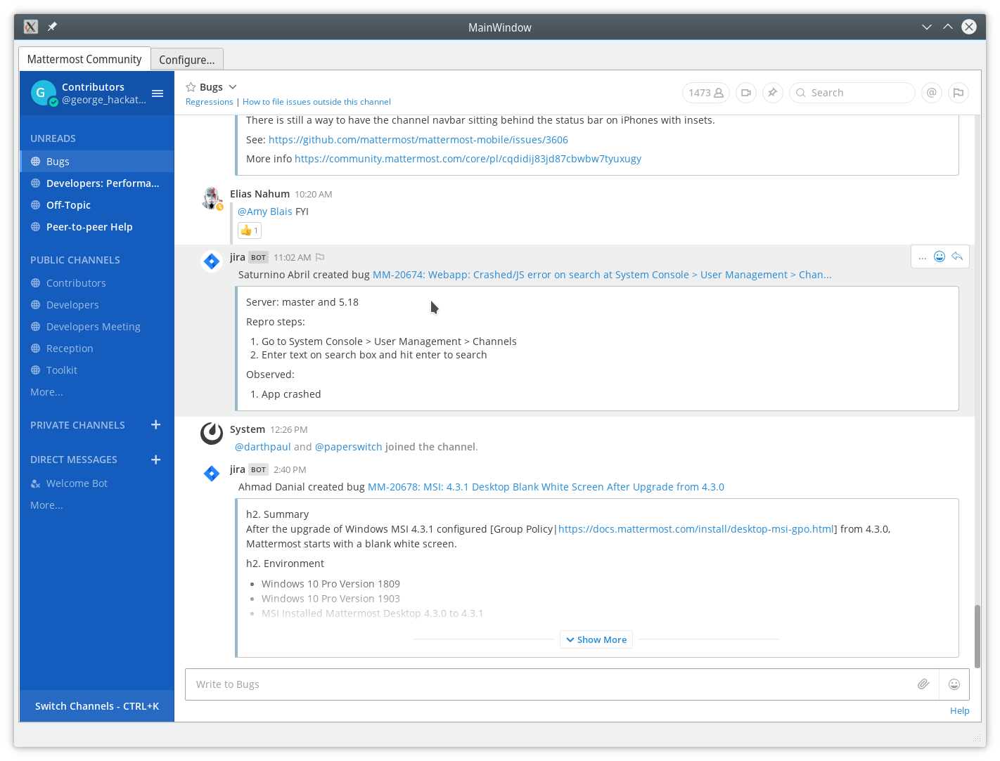

Mattermost Qt
=============

An alternative native shell for the Mattermost Web App using Qt instead of Electron.

Known Issues
------------

This is purely a hackathon prototype. It's nowhere near fully functional (for one, it's hard coded
to connect to community.mattermost.com at the moment.

QtWebEngine has some rendering and javascript performance issues. You'll find, especially on Linux,
that this sucks to use and will only be viable if/when we can overcome them.

How to build
------------

You will need Qt 5.13 (or newer).

    qmake 

    make

    ./mmqt

That's it.

